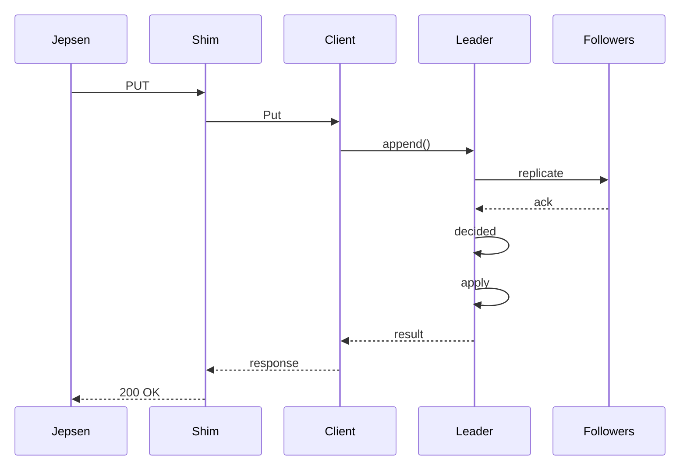

```mermaid
%%{init: {'sequence': {
  'diagramMarginX': 20,
  'diagramMarginY': 20,
  'actorMargin': 30,
  'messageMargin': 8,
  'boxMargin': 5
}}}%%
sequenceDiagram
    participant J as Jepsen
    participant S as Shim
    participant C as Client
    participant O as Leader
    participant P as Followers

    J->>S: PUT
    S->>C: Put
    C->>O: append()

    O->>P: replicate
    P-->>O: ack

    O->>O: decided
    O->>O: apply

    O-->>C: result
    C-->>S: response
    S-->>J: 200 OK
```
