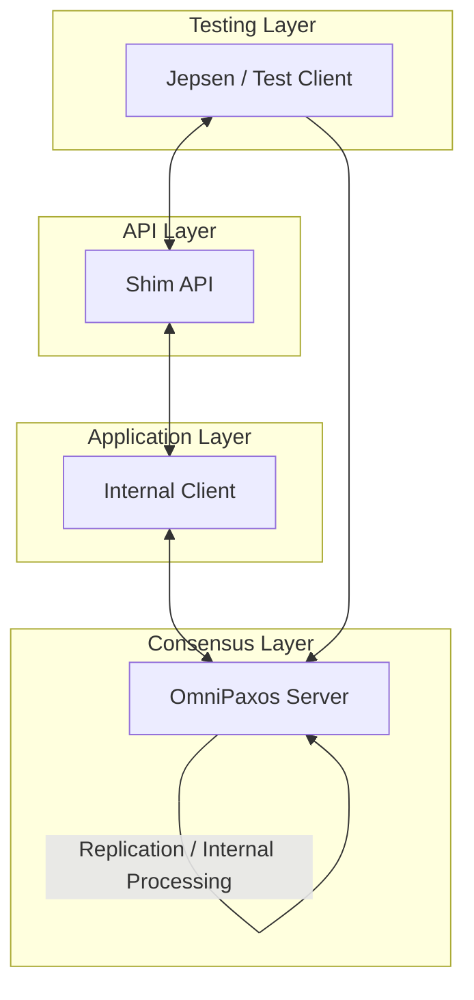

# Battle-testing OmniPaxos with Jepsen

## 1. Introduction

Consensus protocols such as Paxos and Raft provide strong theoretical guarantees including agreement, leader completeness, and safety under crash failures. However, formal correctness proofs apply to the algorithmic model and do not automatically guarantee implementation correctness. Practical systems may violate safety due to concurrency bugs, improper read handling, network edge cases, or incorrect client semantics.

This project evaluates the following hypothesis:

> The OmniPaxos key-value store implementation preserves linearizability under aggressive network partitioning and node failures.

To test this hypothesis, we extended the OmniPaxos KV example with a programmable HTTP shim and subjected it to randomized fault injection in a Jepsen-style environment. The system was tested under concurrent workloads, network partitions, and node crashes. Operation histories were analyzed to detect potential linearizability violations.

---

## 2. System Architecture

### 2.1 Layered Design

The modified system consists of four logical layers:

1. **Testing Layer** – Jepsen client

2. **API Layer** – HTTP shim

3. **Application Layer** – Internal client logic

4. **Consensus Layer** – OmniPaxos server

flowchart TD  



All externally visible operations are routed through the consensus layer before completion. This ensures a single globally ordered log of operations.

---

## 3. HTTP Shim and Client Integration

### 3.1 Motivation

The original OmniPaxos example was not designed for automated black-box testing. It relied on manual interaction and internal networking. To enable Jepsen-style testing, we implemented an HTTP shim that exposes a deterministic API.

### 3.2 API Design

The shim supports:

- `PUT(key, value)`

- `GET(key)`

Each HTTP request is translated into an internal command and forwarded to the consensus layer via asynchronous channels.  

For reads, a oneshot response channel ensures that the HTTP response corresponds exactly to the decided log entry.

---

## 4. Operation Flow and Linearizability

### 4.1 Write Path

A write operation follows this sequence:


The linearization point occurs when the log entry becomes **decided**, i.e., after majority acknowledgment. The client receives a response only after this point.

----

## 5. Testable Shim Implementation

### 5.1 Exposing a Programmable API

To enable automated testing, the OmniPaxos KV store was extended with a programmable HTTP interface. 
The shim translates external client requests into internal commands that can be processed by the consensus layer.

Supported operations:

- PUT(key, value)
- GET(key)

Example command representation:

```rust
pub enum ApiCommand {
    Put(String, String, oneshot::Sender<String>),
    Get(String, oneshot::Sender<String>),
}
```

Example The linearization point occurs when the log entry becomes decided, i.e., after majority acknowledgment. The client receives a response only after this point.HTTP handler:

```rust
async fn http_put(
    State(tx): State<mpsc::Sender<ApiCommand>>,
    Json(req): Json<PutRequest>
) -> String {
    let (resp_tx, resp_rx) = oneshot::channel();
    tx.send(ApiCommand::Put(req.key, req.value, resp_tx)).await.unwrap();
    resp_rx.await.unwrap()
}
```

---

## 6. Client Bridge and Request Handling

The internal client connects the HTTP shim with the OmniPaxos cluster.

Pending operations are tracked using hash maps:

```rust
pending_gets: HashMap<usize, oneshot::Sender<String>>
pending_puts: HashMap<usize, oneshot::Sender<String>>
```

Example write response handling:

```rust
if let ServerMessage::Write(id) = &msg {
    if let Some(tx) = self.pending_puts.remove(id) {
        let _ = tx.send("Ok".to_string());
    }
}
```

Example read response:

```rust
if let ServerMessage::Read(id, value) = &msg {
    if let Some(tx) = self.pending_gets.remove(id) {
        let result = value.clone().unwrap_or_else(|| "Key not found".to_string());
        let _ = tx.send(result);
    }
}
```

---

## 7. Workload Generator

The workload generator produces a random mixture of read and write operations.

Example generator logic:

```rust
match rand::random::<u8>() % 2 {
    0 => client.put("x".to_string(), "1".to_string()).await,
    _ => client.get("x".to_string()).await,
}
```

Each operation records:

- invocation time
- completion time
- result

---

## 8. Handling Indeterminate Operations

Network failures may cause operations to complete without the client receiving a response.

Example request tracking:

```rust
let request_id = self.next_request_id;
self.next_request_id += 1;

self.pending_puts.insert(request_id, response_channel);
```

Requests without responses are marked as indeterminate.

---

## 9. Fault Injection (Nemesis)

### Network Partitions

Example partition handling:

```rust
if network_partition_detected {
    self.omnipaxos.tick();
}
```

### Node Crashes

Example recovery logic:

```rust
if let Some(new_conn) = self.network.recovery_receiver.recv().await {
    self.network.apply_connection(new_conn);
}
```

---

## 10. Linearizable Reads

Reads are executed only after applying all decided log entries.

```rust
let read = self.database.handle_command(command.kv_cmd);
```

Decided entries are retrieved with:

```rust
let decided_entries =
    self.omnipaxos.read_decided_suffix(self.current_decided_idx).unwrap();
```

---

## 11. Persistent Storage

Persistent storage is implemented using RocksDB.

```rust
use omnipaxos_storage::persistent_storage::{
    PersistentStorage,
    PersistentStorageConfig
};
```

OmniPaxos instance:

```rust
type OmniPaxosInstance =
    OmniPaxos<Command, PersistentStoragDownload it here:e<Command>>;
```

---

## 12. Linearizability Verification

Operation history logging example:

```rust
history.push(Operation {
    invocation_time,
    completion_time,
    operation_type,
    result,
});
```

These histories are analyzed using a linearizability checker such as Knossos.

---

## 13. Conclusion

The experiments demonstrate that the OmniPaxos key-value store maintains linearizable behavior even under aggressive failure scenarios including network partitions and node crashes. Persistent storage further improves reliability by allowing nodes to recover state after failures.

---
