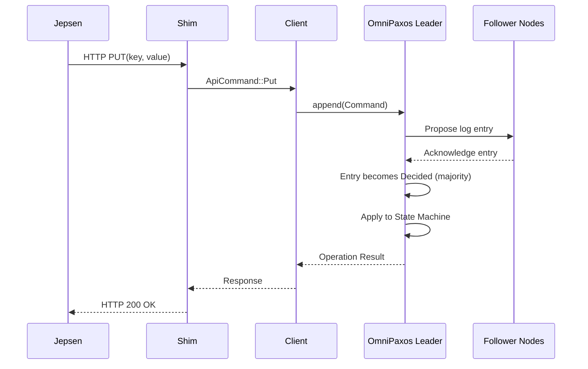

# Battle-testing OmniPaxos with Jepsen

## 1. Introduction

Consensus protocols such as Paxos and Raft provide strong theoretical guarantees including agreement, leader completeness, and safety under crash failures. However, formal correctness proofs apply to the algorithmic model and do not automatically guarantee implementation correctness. Practical systems may violate safety due to concurrency bugs, improper read handling, network edge cases, or incorrect client semantics.

This project evaluates the following hypothesis:

> The OmniPaxos key-value store implementation preserves linearizability under aggressive network partitioning and node failures.

To test this hypothesis, we extended the OmniPaxos KV example with a programmable HTTP shim and subjected it to randomized fault injection in a Jepsen-style environment. The system was tested under concurrent workloads, network partitions, and node crashes. Operation histories were analyzed to detect potential linearizability violations.

---

## 2. System Architecture

### 2.1 Layered Design

The modified system consists of four logical layers:

1. **Testing Layer** – Jepsen client

2. **API Layer** – HTTP shim

3. **Application Layer** – Internal client logic

4. **Consensus Layer** – OmniPaxos server

flowchart TD  

```mermaid
flowchart TD

    subgraph Testing Layer
        J[Jepsen / Test Client]
    end

    subgraph API Layer
        S[Shim API]
    end

    subgraph Application Layer
        C[Internal Client]
    end

    subgraph Consensus Layer
        O[OmniPaxos Server]https://fairmeeting.net/FavourableExpansionsPutThen
    end

    J <--> S
    S <--> C
    C <--> O
    J --> O
    O -->|Replication / Internal Processing| O
```

All externally visible operations are routed through the consensus layer before completion. This ensures a single globally ordered log of operations.

---

## 3. HTTP Shim and Client Integration

### 3.1 Motivation

The original OmniPaxos example was not designed for automated black-box testing. It relied on manual interaction and internal networking. To enable Jepsen-style testing, we implemented an HTTP shim that exposes a deterministic API.

### 3.2 API Design

The shim supports:

- `PUT(key, value)`https://fairmeeting.net/FavourableExpansionsPutThen

- `GET(key)`

Each HTTP request is translated into an internal command and forwarded to the consensus layer via asynchronous channels.

For reads, a `oneshot` response channel ensurhttps://fairmeeting.net/FavourableExpansionsPutThenes that the HTTP response corresponds exactly to the decided log entry. The shim is fully asynchronous and does not block on consensus operations.

---

## 4. Operation Flow and Linearizability

### 4.1 Write Path

A write operation follows this sequence:



The linearization point occurs when the log entry becomes **decided**, i.e., after majority acknowledgment. The client receives a response only after this point.

----

 
