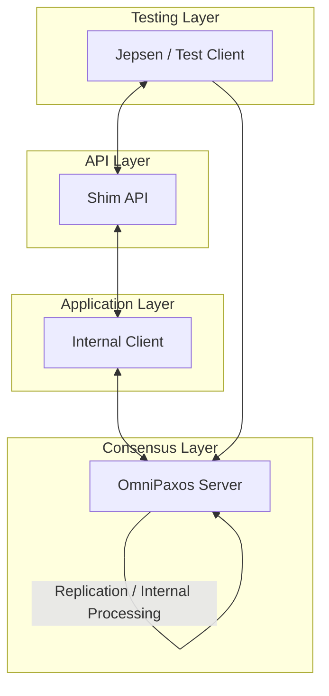
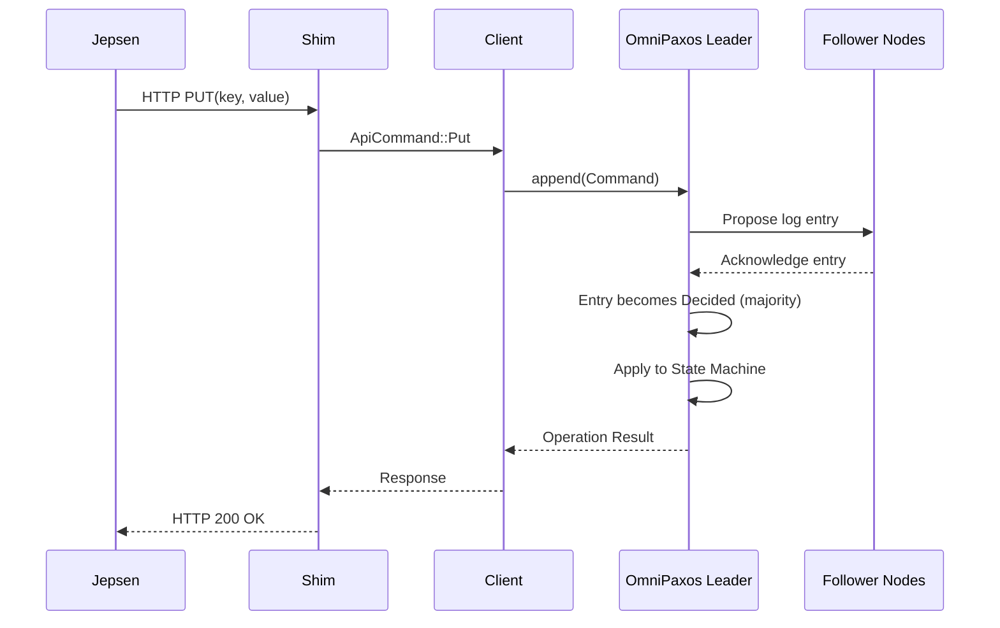

# Battle-testing OmniPaxos with Jepsen

## 1. Introduction

Consensus protocols such as Paxos and Raft provide strong theoretical guarantees including agreement, leader completeness, and safety under crash failures. However, formal correctness proofs apply to the algorithmic model and do not automatically guarantee implementation correctness. Practical systems may violate safety due to concurrency bugs, improper read handling, network edge cases, or incorrect client semantics.

This project evaluates the following hypothesis:

> The OmniPaxos key-value store implementation preserves linearizability under aggressive network partitioning and node failures.

To test this hypothesis, we extended the OmniPaxos KV example with a programmable HTTP shim and subjected it to randomized fault injection in a Jepsen-style environment. The system was tested under concurrent workloads, network partitions, and node crashes. Operation histories were analyzed to detect potential linearizability violations.

---

## 2. System Architecture

### 2.1 Layered Design

The modified system consists of four logical layers:

1. **Testing Layer** – Jepsen client

2. **API Layer** – HTTP shim

3. **Application Layer** – Internal client logic

4. **Consensus Layer** – OmniPaxos server

flowchart TD  



All externally visible operations are routed through the consensus layer before completion. This ensures a single globally ordered log of operations.

---

## 3. HTTP Shim and Client Integration

### 3.1 Motivation

The original OmniPaxos example was not designed for automated black-box testing. It relied on manual interaction and internal networking. To enable Jepsen-style testing, we implemented an HTTP shim that exposes a deterministic API.

### 3.2 API Design

The shim supports:

- `PUT(key, value)`

- `GET(key)`

Each HTTP request is translated into an internal command and forwarded to the consensus layer via asynchronous channels.

For reads, a `oneshot` response channel ensures that the HTTP response corresponds exactly to the decided log entry. The shim is fully asynchronous and does not block on consensus operations.

---

## 4. Operation Flow and Linearizability

### 4.1 Write Path

A write operation follows this sequence:



The linearization point occurs when the log entry becomes **decided**, i.e., after majority acknowledgment. The client receives a response only after this point.

----

## 5. Code-Based Implementation Details

This section explains how the required project functionality is
implemented in the codebase. The explanations connect the conceptual
system architecture with the actual implementation of the OmniPaxos
key-value store.

### 5.1 Implementing the Testable Shim

To support automated testing, the system exposes a programmable
interface through the HTTP shim. The shim converts incoming HTTP
requests into internal commands that can be processed by the OmniPaxos
cluster.

The supported operations are:

- `PUT(key, value)`
- `GET(key)`

Each request is converted into a command and forwarded through
asynchronous communication channels.

Internally, requests are represented as commands:

```rust
ApiCommand::Put(key, value)
ApiCommand::Get(key)
```

The shim communicates with the internal client logic using **Tokio
asynchronous channels**, ensuring that HTTP request handling remains
non-blocking while the distributed consensus protocol processes
operations.

Responses are returned through **oneshot response channels**,
guaranteeing that each HTTP request receives the correct response once
the corresponding log entry has been decided.

---

### 5.2 Client Bridge Between the Shim and the Consensus Layer

The internal client component acts as a bridge between the HTTP API and
the OmniPaxos servers. Its responsibility is to submit operations to the
consensus protocol and return responses to the API layer.

The client maintains internal state for tracking outstanding requests:

```rust
pending_gets: HashMap<usize, oneshot::Sender<String>>
pending_puts: HashMap<usize, oneshot::Sender<String>>
```

Each request receives a unique identifier. When the request is sent to
the server, the client stores a response channel associated with that
identifier.

Once the server completes the operation, the response is matched with
the pending request and returned to the shim.

Example handling of write responses:

```rust
if let ServerMessage::Write(id) = &msg {
    if let Some(tx) = self.pending_puts.remove(id) {
        let _ = tx.send("Ok".to_string());
    }
}
```

Similarly, read responses return the requested value:

```rust
if let ServerMessage::Read(id, value) = &msg {
    if let Some(tx) = self.pending_gets.remove(id) {
        let result = value.clone().unwrap_or_else(|| "Key not found".to_string());
        let _ = tx.send(result);
    }
}
```

---

### 5.3 Submitting Commands to the Replicated Log

When a client issues an operation, it is appended to the OmniPaxos
replicated log.

```rust
let command = Command {
    client_id: from,
    coordinator_id: self.id,
    id: command_id,
    kv_cmd: kv_command,
};
```

The command is appended to the log:

```rust
self.omnipaxos.append(command)
```

OmniPaxos then replicates the entry to follower nodes through the
consensus protocol.

---

### 5.4 Applying Decided Log Entries

Once a log entry has been acknowledged by a majority of nodes, it
becomes **decided**.

```rust
handle_decided_entries()
```

The server retrieves the decided entries:

```rust
let decided_entries =
    self.omnipaxos.read_decided_suffix(self.current_decided_idx).unwrap();
```

These commands are then applied to the replicated state machine:

```rust
self.update_database_and_respond(decided_commands);
```

---

### 5.5 State Machine Execution

The replicated state machine is implemented as an in-memory key-value
store.

```rust
let read = self.database.handle_command(command.kv_cmd);
```

Read operations return the stored value, while write operations return a
confirmation message.

---

### 5.6 Handling Cluster Communication

Cluster messages are processed using:

```rust
handle_cluster_messages()
```

OmniPaxos protocol messages are handled as:

```rust
ClusterMessage::OmniPaxosMessage(m) => {
    self.omnipaxos.handle_incoming(m);
    self.handle_decided_entries();
}
```

---

### 5.7 Leader Election

Leader election is handled internally by OmniPaxos.

```rust
self.omnipaxos.tick();
```

The current leader can be retrieved using:

```rust
self.omnipaxos.get_current_leader()
```

---

### 5.8 Handling Failures and Recovery

When nodes reconnect after failures, they synchronize their logs with the leader and apply missing entries to restore the replicated state.

---

### 5.9 Storage Implementation

The system uses in-memory storage:

```rust
type OmniPaxosInstance = OmniPaxos<Command, MemoryStorage<Command>>;
```

Log entries are stored only in memory. After a crash, a node reconstructs its state by synchronizing log entries from other replicas.

---

## 6. Fault Injection (Nemesis)

Failure scenarios were introduced during testing.

### 6.1 Network Partitions

Two partition scenarios were evaluated:

- Leader isolation
- Split-brain partition

Only the majority partition can elect a leader and commit operations.

### 6.2 Node Crashes

Nodes were randomly terminated and restarted during testing. After
recovery, nodes synchronized missing log entries from the leader.

---

## 7. Linearizability Verification

The operation history produced during testing contains:

- invocation time
- completion time
- operation type
- returned result

A linearizability checker verifies that the operations can be ordered
sequentially while respecting real-time ordering.

---

## 8. Bonus Task: Persistent Storage

The current implementation uses **MemoryStorage**, meaning log entries
are stored in memory.

If a node crashes, it reconstructs its state by synchronizing log
entries from other replicas after rejoining the cluster.

Persistent storage using RocksDB is supported by OmniPaxos.
