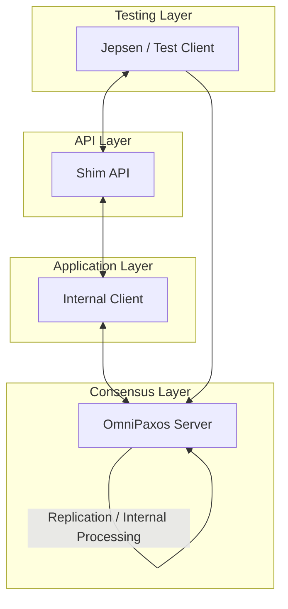
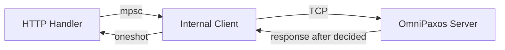
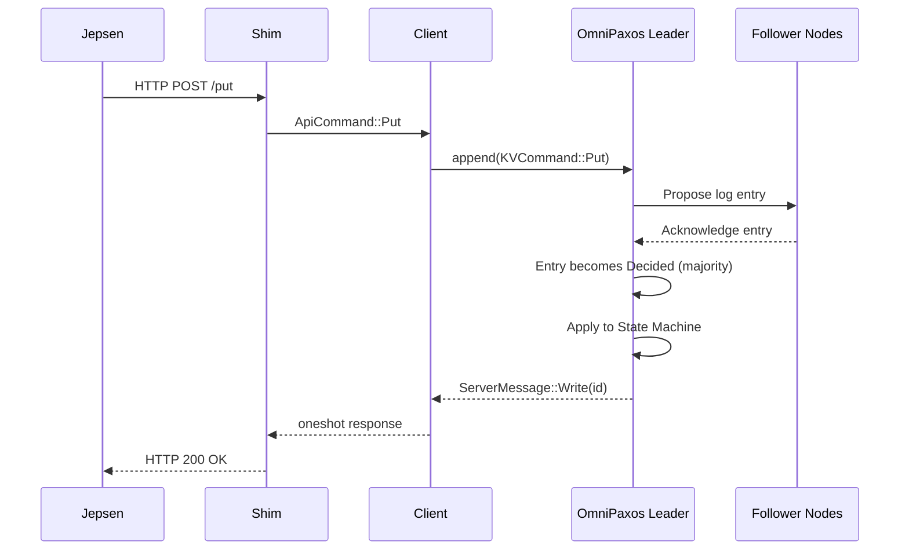
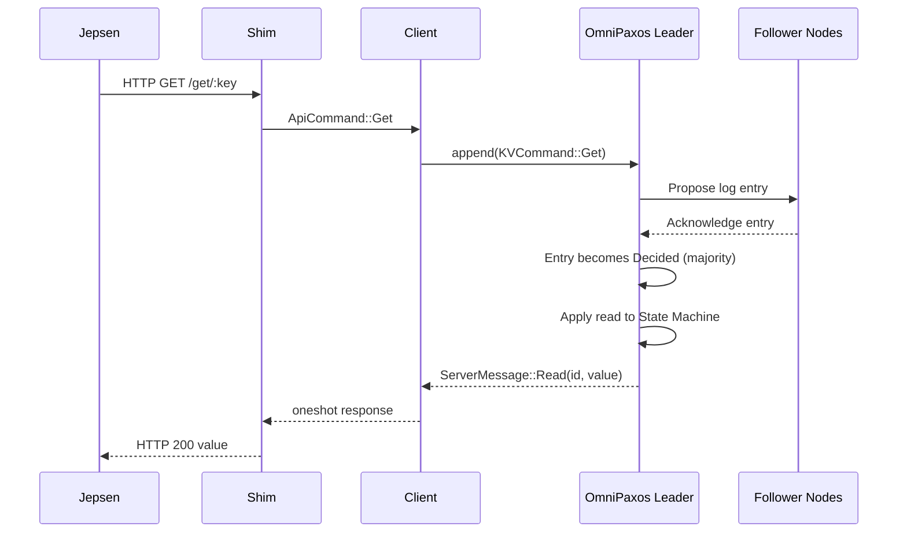

# Battle-testing OmniPaxos with Jepsen

## 1. Introduction

Consensus protocols such as Paxos and Raft provide strong theoretical guarantees including agreement, leader completeness, and safety under crash failures. However, formal correctness proofs apply to the algorithmic model and do not automatically guarantee implementation correctness. Practical systems may violate safety due to concurrency bugs, improper read handling, network edge cases, or incorrect client semantics.

This project evaluates the following hypothesis:

> The OmniPaxos key-value store implementation preserves linearizability under aggressive network partitioning and node failures.

To test this hypothesis, we extended the OmniPaxos KV example with a programmable HTTP shim and subjected it to randomized fault injection using a Jepsen test suite. The system was tested under concurrent workloads, network partitions, and node crashes. Operation histories were then analyzed by the Knossos linearizability checker. We additionally implemented persistent storage to verify that the system recovers correctly after crashes without losing committed data.

## 2. System Architecture

### 2.1 Layered Design

The modified system consists of four logical layers:

1. **Testing Layer** – Jepsen orchestrates the test: it drives the client, controls the nemesis, and collects the operation history.
2. **API Layer** – An HTTP shim (Axum) exposes `PUT` and `GET` endpoints on each node, translating HTTP requests into internal commands.
3. **Application Layer** – The internal client manages the connection to a single OmniPaxos server, queues pending requests, and handles reconnection.
4. **Consensus Layer** – OmniPaxos servers replicate all operations through a distributed log before applying them to the key-value store.



All externally visible operations are routed through the consensus layer before completion. This ensures a single globally ordered log of operations.

### 2.2 Deployment

The cluster runs as six Docker containers: three server nodes (`s1`, `s2`, `s3`) and three client/shim nodes (`c1`, `c2`, `c3`). Each client is pinned to its corresponding server, with `c1` connecting to `s1`, and so on. The HTTP shims listen on port 3000 inside their containers, exposed on the host as `localhost:3001`, `3002`, and `3003`. Jepsen reaches each container via SSH over loopback addresses (`127.0.0.2`–`127.0.0.4`) and issues HTTP requests to the corresponding shim endpoint — for example, a request for node `127.0.0.2` goes to `http://localhost:3001`. This means Jepsen's SSH connections are unaffected by the Docker-level network partitions applied by the partition nemesis.

## 3. HTTP Shim and Client Integration

### 3.1 API Design

The shim exposes two endpoints:

- `POST /put`: accepts a JSON body `{ "key": "...", "value": "..." }` and performs a write.
- `GET /get/:key`: returns the current value for the given key.

Each HTTP request is converted into an `ApiCommand` and sent over an async channel (`mpsc`) to the internal client. A `oneshot` response channel is attached so the HTTP handler can await the result. This ensures that the HTTP response corresponds exactly to the decided log entry; the caller never receives a response before the operation is committed.



### 3.2 Timeout and Indeterminate States

There are two independent timeouts in the system. The shim applies a **10-second internal timeout** to each request waiting on consensus: if no decision arrives within that window, the HTTP handler returns an error string. Separately, each Jepsen test configures its own socket timeout tuned to its fault type: **500 ms** for kill (SIGKILL drops the TCP connection immediately, so failure is detected instantly); **1 s** for partition (iptables DROP silently discards packets with no TCP RST, requiring a slightly longer window to time out); and **3 s** for recovery (the restarting node must reload state from disk before its shim can serve requests, so a longer window reduces spurious failures during the reconnection phase). These timeouts fire first during fault windows and allow the test to quickly record in-flight writes as `:info` without waiting for the full shim timeout. Jepsen records these operations with type `:info` (indeterminate), meaning the operation may or may not have succeeded. Knossos handles `:info` operations conservatively, considering all possible orderings when checking linearizability.

### 3.3 Reconnection

When the client detects a dropped connection (via a 2-second polling interval), it fails all pending requests immediately and enters a reconnection loop with 2-second retries. This prevents Jepsen from hanging indefinitely and allows the test to continue issuing operations while the cluster recovers.

## 4. Operation Flow and Linearizability

### 4.1 Write Path

A write operation follows this sequence:



The linearization point occurs when the log entry becomes **decided**, meaning a majority of nodes have acknowledged it. The client receives a response only after this point.

### 4.2 Read Path and Linearizable Reads

A naive implementation might serve reads directly from the leader's local state. This is tempting because it avoids a consensus round, but it is **not linearizable**. If a leader is partitioned from the rest of the cluster, it may not know that a new leader has been elected. It would then serve stale values to clients, violating linearizability, which requires every read to reflect all writes that completed before it.

Our solution is to route reads through consensus just like writes. `KVCommand::Get` is appended to the OmniPaxos log, and the response is only sent after the entry is decided:



This approach has a clear linearization guarantee: a `Get` issued at time `t` is ordered in the log relative to all concurrent `Put` operations. Any write that returned before `t` must have been decided at a lower log index, and therefore its effect is visible to the read. A minority leader cannot serve reads at all; it cannot achieve quorum and will not decide any entries.

The trade-off is that reads are slower (a full consensus round), but correctness is guaranteed.

## 5. Fault Injection

We implemented three Jepsen test scenarios, each targeting a different failure mode.

### 5.1 Nemesis Kill (`nemesis_kill`)

This test kills a random server node with `SIGKILL` and restarts it after 30 seconds. At all times, 2 out of 3 nodes remain alive, preserving quorum. Operations are generated at **2 ops/sec per worker** (0.5 s average stagger) across 4 concurrent workers over a 300-second run.

**Generator pattern:**
```
1. Sleep 5 s        (stabilize)
2. Kill random node
3. Sleep 30 s       (re-election)
4. Restart node
5. Sleep 20 s       (stabilize)
6. Repeat
```

When a server is killed, in-flight writes to its shim time out on Jepsen's socket timeout before completing. Jepsen records these as `:info` (indeterminate). If the killed node was the leader, OmniPaxos triggers re-election; surviving nodes elect a new leader within a few election timeouts (configured at 500 ms).

### 5.2 Nemesis Partition (`nemesis_partition`)

This test injects network partitions using `iptables DROP` rules on Docker's internal network. It induces a split-brain scenario by dividing the 3-node cluster into two halves, typically isolating one node from the other two. Operations are generated at **2 ops/sec per worker** across 4 concurrent workers over a 300-second run.

**Generator pattern:**
```
1. Sleep 10 s                  (stabilize)
2. Apply split-brain partition
3. Sleep 20 s                  (minority loses quorum)
4. Heal partition
5. Sleep 10 s                  (reconnect and leader stabilize)
6. Repeat
```

The partition is applied at the Docker internal IP layer (not the SSH loopback addresses), which means it affects OmniPaxos inter-node communication but not Jepsen's SSH connections. The minority partition (1 node) loses quorum and cannot commit new entries. If the leader is in the minority, it cannot make progress and any writes directed to it will timeout. When the partition heals, OmniPaxos performs ballot reconciliation to bring the isolated node back into the consistent state.

### 5.3 Nemesis Recovery (`nemesis_recovery`)

This test kills a single random node and restarts it after 30 seconds, using a longer post-restart stabilization window (30 s vs 20 s in `nemesis_kill`) to allow persistent state to load before the next cycle. At all times, 2 out of 3 nodes remain alive, so quorum is preserved throughout. The test is specifically designed to exercise persistent storage: the restarted node must reconstruct its state from disk before rejoining the cluster. Operations are generated at **2 ops/sec per worker** across 4 concurrent workers over a 300-second run. The recovery mechanism is described in detail in Section 6.

**Generator pattern:**
```
1. Sleep 10 s   (stabilize)
2. Kill random node
3. Sleep 30 s   (re-election + recovery)
4. Restart node
5. Sleep 30 s   (rejoin + catch-up)
6. Repeat
```

## 6. Persistent Storage and Recovery

### 6.1 Motivation

Without persistence, a crashed node restarts with empty state and must receive the full log from surviving peers before it can rejoin. Persistent storage avoids this by letting a node reconstruct most of its state locally, and provides durability guarantees so that committed data survives crashes.

### 6.2 Two-Layer Persistence

We implement persistence at two separate layers because they serve fundamentally different purposes and operate at different levels of the stack.

**OmniPaxos log (RocksDB).** OmniPaxos's `PersistentStorage` backend stores the consensus protocol state — ballot number, proposed log entries, and the decided index — in a RocksDB database at `/app/logs/omnipaxos-node-{id}`. This layer is owned and managed entirely by OmniPaxos. Its purpose is to allow the consensus engine to resume correctly after a crash: without it, a restarted node would appear to OmniPaxos as a brand-new participant with an empty ballot and no log, forcing it to receive and re-replicate the entire history from surviving peers. With RocksDB, OmniPaxos can restore its ballot state and log independently of the rest of the cluster.

**Database snapshot (JSON).** The key-value store state is periodically snapshotted to `/app/logs/server-{id}-snapshot.json`. Each snapshot records the full database contents and the `decided_idx` at the time of the snapshot. Writes use an atomic `rename` pattern (write to `.tmp`, then rename) with `fsync` to prevent partial writes from corrupting the snapshot file. With `SNAPSHOT_INTERVAL = 1`, a snapshot is written after every decided entry. This layer is owned and managed by the application, not by OmniPaxos.

Neither layer alone is sufficient: without RocksDB, OmniPaxos cannot resume consensus correctly; without the JSON snapshot, recovery becomes increasingly expensive as the log grows.

### 6.3 Recovery Sequence

When a server restarts:

1. It loads the latest database snapshot from disk, restoring the KV state and the `decided_idx` at the time the snapshot was taken.
2. It opens the RocksDB storage, which independently restores OmniPaxos's consensus state: ballot number, log entries, and decided index.
3. As new entries are decided (either replayed from the local RocksDB log or received from peers), the server skips any entry whose log index is $\leq$ `snapshot_decided_idx` — these are already reflected in the restored KV state. Only entries above that index are applied to the database.
4. The server reconnects to peers and participates in leader election normally.

### 6.4 Leader Recovery

If the killed node was the leader, a new leader is elected while it is down. When it restarts, it discovers a higher ballot via peer messages and steps down. It then catches up on any entries it missed while offline. Because OmniPaxos uses ballot numbers to prevent old leaders from committing, there is no risk of split-brain.

## 7. Experimental Results

### 7.1 Results Summary

| Test | Nemesis | Duration | Total ops | Knossos |
|------|---------|----------|-----------|---------|
| kill | Random node SIGKILL | 300 s | 588 | valid |
| partition | Split-brain (iptables) | 300 s | 616 | valid |
| recovery | Kill + persistent restart | 300 s | 581 | valid |

Operation counts (ok = confirmed, info = indeterminate, fail = refused):

| Test | ok writes | ok reads | info writes | info reads | fail reads |
|------|-----------|----------|-------------|------------|------------|
| kill | 204 | 226 | 85 | 40 | 33 |
| partition | 223 | 222 | 99 | 72 | 0 |
| recovery | 251 | 236 | 42 | 28 | 24 |

All histories were verified as linearizable by Knossos. For example, the recovery test ended with:

```edn
{:linear {:valid? true, :model #knossos.model.Register{:value 41}}, :valid? true}
```

No lost writes or stale reads were detected in any run.

### 7.2 Observations

**During partitions**, 99 writes and 72 reads became `:info` as operations directed at partitioned nodes hit Jepsen's socket timeout while the minority side lost quorum. Zero reads returned `:fail` — partitioned nodes simply stopped making progress rather than closing connections, so Jepsen workers experienced timeouts rather than refused connections. Once the partition healed, OmniPaxos performed ballot reconciliation and the isolated node rejoined. Knossos verified the full 616-operation history as linearizable.

**During kills**, 85 writes and 40 reads became `:info` as operations directed at the killed node's shim timed out before the socket closed. An additional 33 reads returned `:fail` — a marked increase from the 0 in the earlier 60-second run. This is expected: with a 300-second window and 4 concurrent workers, Jepsen issues far more operations during kill windows, and clients polling the dead shim receive connection-refused errors that Jepsen records as `:fail`. No stale value was ever returned — the surviving two nodes held quorum and continued committing entries, while the killed node's shim served no responses at all. Knossos verified the full 588-operation history as linearizable.

**After recovery**, the restarted node rejoined the cluster and caught up on missed entries via persistent state and peer catch-up. The 300-second recovery test produced 24 `:fail` reads and 28 `:info` reads, occurring during the windows when the killed node's shim was unreachable and clients received connection-refused errors before reconnection. The higher fail count compared to the kill-only test reflects the longer post-kill stabilization window (30 s) during which the shim is down. Knossos verified the full 581-operation history as linearizable.

## 8. Discussion

### 8.1 Linearizable Reads Trade-off

Routing reads through consensus is the safest approach, but it doubles the latency of read operations compared to leader-local reads.

### 8.2 Indeterminate Operations

A recurring challenge in distributed testing is handling operations that may or may not have succeeded. Our shim returns errors on timeout or disconnection, which Jepsen records as `:info`. If these were recorded as `:ok`, Knossos could find false violations (a write appears in the history but the system never acknowledged it). If they were `:fail`, we might miss real violations (a write was committed but not acknowledged). The `:info` type correctly expresses the ambiguity, and Knossos handles it by exploring all possible orderings.

### 8.3 Single-Key Workload

All three tests operate on a single shared key (`jepsen-key`). This is intentional: using a single register maximizes contention and makes linearizability violations easiest to detect. Knossos uses the **register** model, which expects at most one value at any time and can detect stale reads and lost writes efficiently on a single key.

---

## 9. Conclusion

The key design decision was to route all read operations through the consensus log rather than serving them locally from the leader. This guarantees that reads are always consistent with the most recently committed writes, even under leader changes and partitions, at the cost of an extra consensus round per read. The two-layer persistence approach — RocksDB for the OmniPaxos log and atomic JSON snapshots for the KV state — ensures a crashed node can recover and rejoin without data loss or expensive log replay.

All experiments confirmed the initial hypothesis: the OmniPaxos implementation preserves linearizability under aggressive fault injection.
